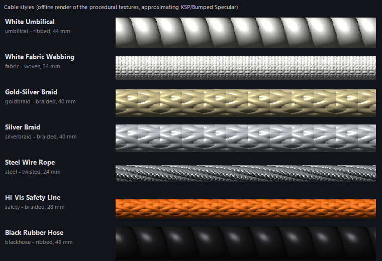
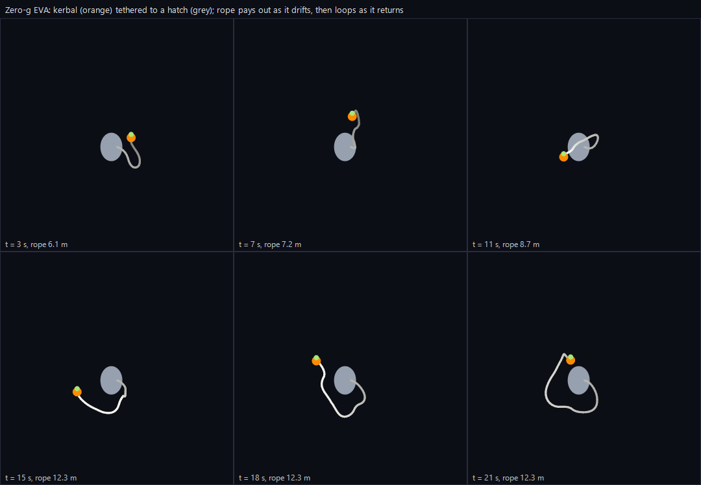
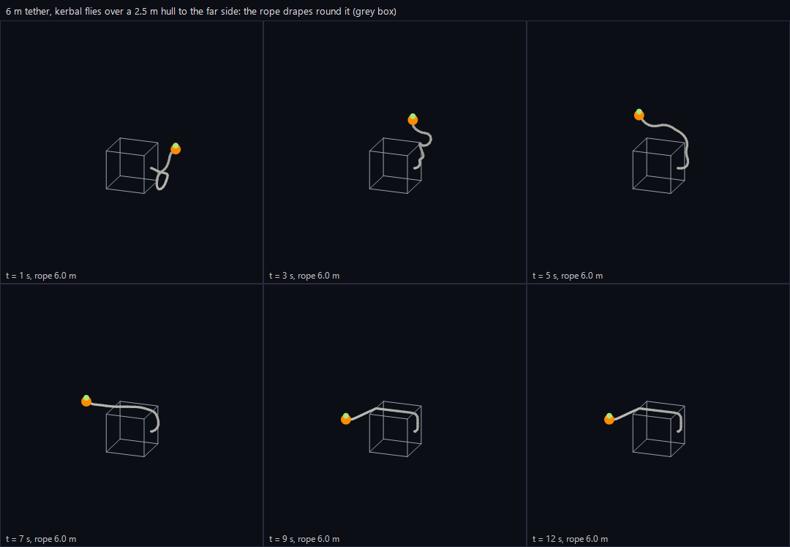

# KSP Tethers

**Dynamic, flowing EVA tethers and ship-to-ship cables for Kerbal Space Program.**

[](https://www.kerbalspaceprogram.com/)
[](https://github.com/sarbian/ModuleManager)
[](https://github.com/CritZitGaming/KSP-Tethers/releases)
[](LICENSE)

Kerbals get a reel-mounted umbilical on their backpack that clips onto any part or another kerbal, and can
carry the free end over to another ship to rig a cable between vessels. The rope is fully simulated: it floats
in lazy loops in zero-g, hangs and piles up in the dust on the Mun, streams behind you in an atmosphere, drapes
over hulls instead of passing through them, and pulls once it runs out of slack. Through the lifeline it can
keep a kerbal's suit topped up with power and life support, and take the waste back to the ship.

<p align="center">
  
</p>

<p align="center">
  
  <br>
  <br><sub>Rope renders from the offline solver tests, not in-game screenshots.</sub>
</p>

---

## Install

### CKAN

> **CKAN listing pending.** KSP Tethers has been submitted to CKAN and is waiting for review. Until it is
> listed, install it manually.

Once it is listed, search for **KSP Tethers** and install. CKAN pulls in Module Manager for you.

### Manual

1. Install [Module Manager](https://github.com/sarbian/ModuleManager/releases) if you don't have it.
2. Download the latest `KSPTethers-<version>.zip` from [Releases](https://github.com/CritZitGaming/KSP-Tethers/releases).
3. Drag the `KSPTethers` folder into your KSP `GameData/` folder, so you end up with
   `Kerbal Space Program/GameData/KSPTethers/`.

### Requirements

| | |
|---|---|
| **KSP** | 1.12.x |
| **Required** | Module Manager |
| **Recommended** | ToolbarControl (lets you choose the stock launcher and/or Blizzy's toolbar) and ClickThroughBlocker |
| **Works with** | TAC Life Support, Kerbalism and other mods that keep resources in EVA suits |

---

## Features

- **Simulated rope**: position-based solver (inextensible, bending stiffness with a minimum bend radius, static
  and sliding friction, air drag, self-collision), drawn as a smooth tube with metal fittings at both ends.
- **Correct in every environment**: the rope floats freely in orbit, sags under gravity when landed, is pushed
  back during burns and streams downwind in atmosphere. It is simulated in the anchor's frame, so KSP's
  floating origin and Krakensbane never disturb it.
- **Collisions**: the rope rests on terrain and drapes over parts and kerbals instead of clipping through, and
  once it wraps around a ship the tether pulls from where it touches the hull, so it can't be dragged through.
- **Physical tether**: once taut, a soft spring-damper tuned to the masses on each end restrains the kerbal (or
  tows the other ship). Slack costs nothing.
- **Reel**: pays out automatically as the kerbal moves away, and reels in to haul a kerbal back to the hatch.
  Reeling in first takes up slack, then pulls.
- **Rescue from the ship**: right-click a tethered kerbal while controlling the vessel and choose **Reel In** to
  bring back a kerbal who ran out of EVA propellant.
- **Tethers between anything**: kerbal to part, kerbal to kerbal, and part to part (ship to ship, station to
  rover). Any number of cables can link any number of vessels.
- **Lifeline**: carries ElectricCharge, Oxygen, Food, Water and other supplies into the suit, and CO2, Waste and
  WasteWater back, for mods that keep resources in EVA suits. Kerbal-to-kerbal tethers share supplies; ship
  cables can even out resources between vessels. Optionally refuels jetpacks from the ship's MonoPropellant.
- **Cable styles**: white umbilical, white fabric webbing, gold-silver braid, silver braid, steel wire rope,
  hi-vis safety line and black rubber hose. One look for EVA tethers, another for ship cables, plus thickness.
- **Toolbar app**: manage every tether and cable, pick styles, switch the lifeline and individual resources, and
  rebind keys.
- **Auto-tether**: kerbals leaving a hatch in space are clipped to the hull beside the hatch.
- **Persistence**: tethers and cables survive saving, loading, scene changes, vessel switching and time warp.

## Using tethers

| Action | Keyboard (active EVA kerbal) | Right-click menu |
| --- | --- | --- |
| Clip onto a part or kerbal | `Y`, then click it (within reach) | **Clip Tether (point & click)** |
| Clip onto the nearest part | `Y` twice | **Clip Tether to Nearest Part** |
| Clip your end elsewhere (rig a cable / hand over) | tap `Y`, then click a part or kerbal | **Clip Free End Elsewhere** |
| Pick up the end of a cable | `Y`, then click the cable's end | |
| Release | hold `Y` | **Release Tether** |
| Reel in / out | hold `-` / `=` | **Reel In** / **Reel Out** (toggles) |
| Set the tether length | | **Tether length** slider |

While aiming, the part under the mouse is highlighted green (in reach) or red, and a label next to the cursor
says what a click will do. A quick right-click cancels. **Release** and **Reel In/Out** also appear when you
right-click a tethered kerbal from another vessel.

**Rigging a cable between two ships**: clip onto ship A, fly to ship B, tap `Y` and click a part on ship B. Your
end is clipped there and you are free; the cable stays between the two ships. Reel and release cables from the
toolbar app. An untethered kerbal can click near a cable's end to unclip it and carry it somewhere else.

## Toolbar app

- **Tethers**: every tether and cable in the scene, with distance and length, reel buttons, release, the
  lifeline's status and (for cables) "Share resources".
- **Cables**: the style for EVA tethers, the style for cables between ships, and thickness. Changes apply live.
- **Resources**: the lifeline master switch, transfer speed, buddy sharing, the default for new cables, and a
  switch per resource. It also reports which life support mods are installed and working.
- **Keys**: click a key and press a new one. Clashes with KSP's own bindings are flagged.

## Settings

**Difficulty Settings > KSP Tethers** (per save): auto-tether (and only in space), physical or cosmetic tethers,
kerbal-to-kerbal tethers, self-retracting reel, default and maximum length, clip reach and reel speed.

**`KSPTethers/Settings.cfg`** (global): simulation tuning, spring frequencies, break forces, collisions,
wrapping, the `CABLE_STYLE` list and the `TETHER_RESOURCE` list. Everything is documented in the file and can
be changed with ModuleManager against the `KSP_TETHERS` node. The app's choices are saved separately in
`KSPTethers/PluginData/UserSettings.cfg`.

## Life support notes

- Only resources that are actually stored on the EVA kerbal are moved; nothing is created or destroyed.
- **TAC Life Support** and **Kerbalism** keep supplies in EVA suits, so tethered kerbals stay supplied.
- **USI Life Support** doesn't store supplies in EVA suits, so tethers can't feed it.
- Jetpack refuelling (EVA Propellant from the ship's MonoPropellant) is off by default; switch it on in the app.

## Compatibility notes

- Works alongside KAS/KIS: they add their own modules to kerbals and do not interact with these tethers.
- The backpack attach point uses the `bn_jetpack01` bone. If a suit mod moves it, adjust `kerbalBone` /
  `kerbalOffset` in `Settings.cfg`.
- Cables pull on the parts they are clipped to; clip ship cables to sturdy parts, as a flimsy part can be torn
  off when towing heavy vessels.
- Seating a kerbal in a command seat releases its tether.

## How it works

- `TetherCore` is one tether: two `TetherEnd`s (a clip on a part, or a kerbal's backpack), the physical link (a
  `ConfigurableJoint` with a soft spherical limit, spring set from the reduced mass and a natural frequency),
  the reel, and the rope. Kerbal tethers are owned by `ModuleKerbalTether` (added to EVA kerbals by
  ModuleManager); cables between parts by `TetherScenario`, which saves them in the save file.
- `RopeSimulation` is a Verlet/PBD solver with long-range attachments, bending constraints with a minimum bend
  radius, a spool at the anchor end so length changes never make the rope jump, and Coulomb friction. Contact
  planes for nodes and segment midpoints are found once per substep and enforced inside the solver
  iterations; self-collision uses segment-segment tests with sweep-and-prune.
- When the straight line between a tether's ends is blocked by the vessel at the far end and the rope rests
  against it, the joint moves its pivot to the rope's last contact with the hull (and shortens its reach by the
  rope already wrapped), so the physics follows the rope's real path.
- `TubeMeshBuilder` sweeps a parallel-transported tube along a Catmull-Rom spline and adds the fittings.
  `CablePatterns` generates seamless ribbed, braided, woven and twisted-strand textures and normal maps.
- `ResourceExchange` holds the lifeline rules; `TetherResources` applies them to suits and vessels.

## Building from source

Requires the .NET SDK (6 or newer), the .NET Framework 4.7.2 targeting pack and a KSP 1.12 install for the
reference assemblies.

```powershell
./Tools/Build.ps1                                   # build into KSPTethers/Plugins, run the offline tests, make dist/KSPTethers-<version>.zip
./Tools/Build.ps1 -KSPRoot "D:\Games\Kerbal Space Program"
./Tools/Install.ps1                                 # copy KSPTethers into a KSP install (keeps your saved app settings)
```

The plugin can't be compiled in CI because it needs KSP's own assemblies, so `KSPTethers/Plugins/KSPTethers.dll`
is committed. Rebuild it with `Tools/Build.ps1` before tagging a release; the release workflow refuses a DLL
that doesn't carry the tagged version.

`Tests/RopeSimTests` runs the rope solver, mesh builder, cable patterns and lifeline rules outside the game.
To eyeball the rope and the cable styles without launching KSP:

```powershell
Tests/RopeSimTests/bin/Release/net472/RopeSimTests.exe render snapshots
```

Toolbar icons are PNGs with transparency: `KSPTethers/Icons/tether_38.png` (38x38, stock launcher) and
`tether_24.png` (24x24, Blizzy's toolbar). Replace those two files to change the artwork.

## Releasing

Bump the version in `Source/KSPTethers.csproj`, `Source/Properties/AssemblyInfo.cs` and
`KSPTethers/KSPTethers.version`, run `Tools/Build.ps1`, commit, then push a `v<version>` tag. The release
workflow checks that all three agree with the tag, builds `KSPTethers-<version>.zip` and attaches it to a GitHub
release, which CKAN picks up. See [CKAN/README.md](CKAN/README.md).

## Licence

[MIT](LICENSE).
